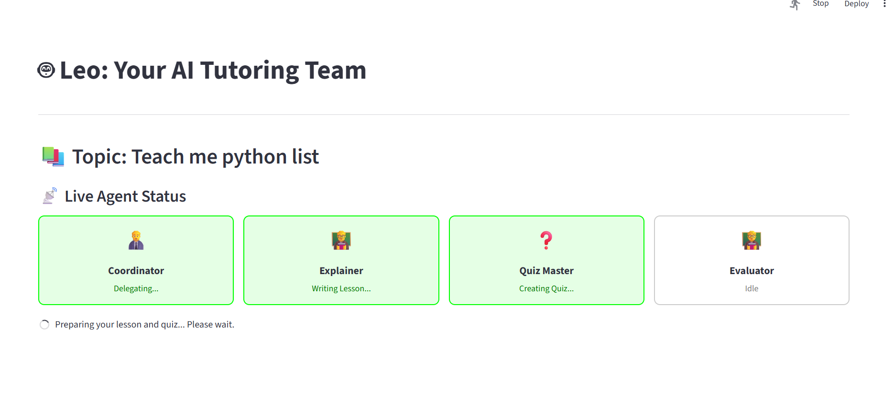
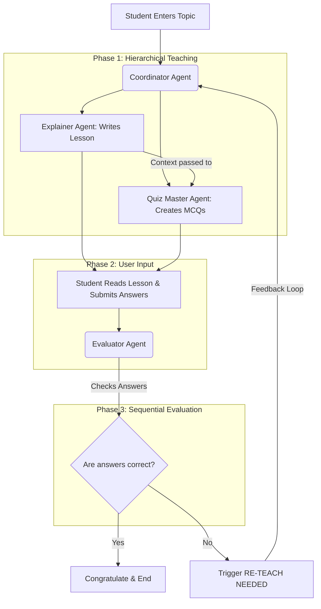
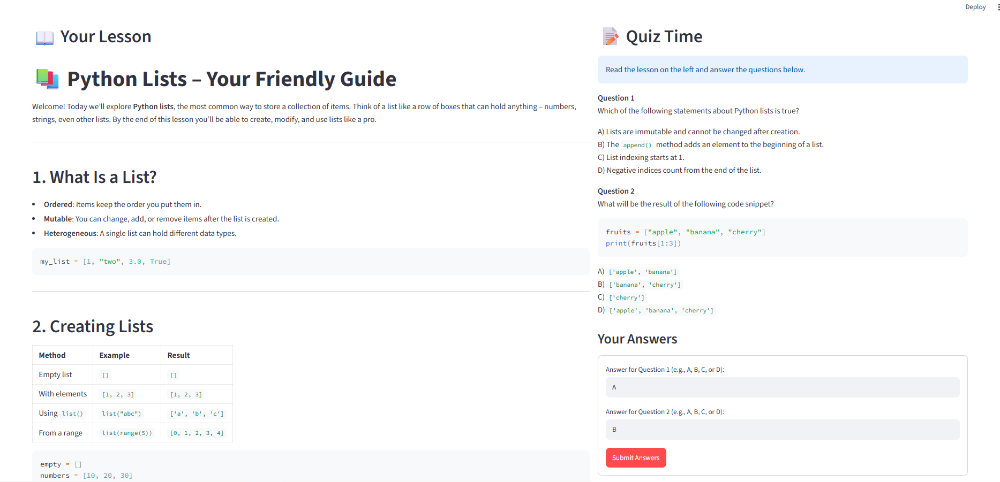
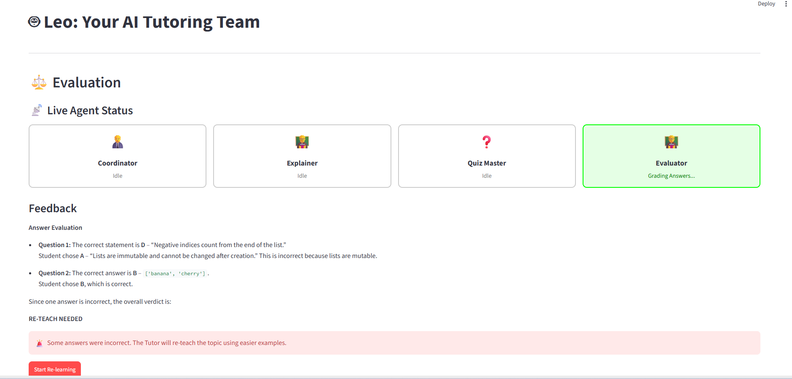
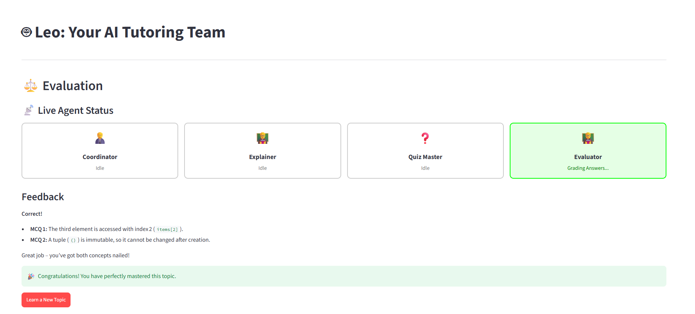

# 🤖 Leo: Multi-Agent AI Tutor


*Live Agent Status indicating which agents are actively preparing the lesson and quiz.*

## 📖 Project Overview
**Leo** is an advanced, interactive multi-agent educational platform powered by **CrewAI** and **Streamlit**. Instead of relying on a single generic chatbot, Leo utilizes a team of specialized AI agents working together to teach concepts, test knowledge, and provide personalized feedback. If a student struggles with a concept, the system automatically triggers a re-teaching loop with easier examples, ensuring complete mastery of the topic.

## ✨ Key Features
* **Multi-Agent Collaboration:** Specialized agents (Manager, Teacher, Quizzer, Grader) handle distinct parts of the learning process.
* **Human-in-the-Loop:** Pauses execution to take real student input for quizzes.
* **Dynamic Feedback Loop (Re-teaching):** Automatically generates simpler explanations if the student answers incorrectly.
* **Live Agent Status UI:** A visually appealing dashboard showing which agent is currently "thinking" or "acting".
* **Context Passing:** Seamlessly passes the lesson context to the quiz creator, and both to the evaluator for accurate grading.

## 🌍 Real-Life Impact & Applications
* **Personalized Education:** Adapts to the learner's pace. If they fail, it re-teaches differently rather than just giving the correct answer.
* **Scalable Automated Tutoring:** Educational institutions can deploy this to provide 24/7 personalized 1-on-1 tutoring.
* **Self-Assessment:** Professionals and students can quickly learn new technical concepts (like APIs, Python) and immediately test their understanding.

---

## 🕵️‍♂️ The Agents and Their Roles

1. **Coordinator (Manager):** 👨‍💼 
   * **Role:** Tutor Coordinator and Manager.
   * **Task:** Understands the student's learning request and orchestrates the workflow. It delegates the teaching task to the Explainer and the assessment task to the Quiz Master.
2. **Explainer (Teacher):** 👨‍🏫
   * **Role:** Concept Explainer.
   * **Task:** Breaks down complex topics into clear, bite-sized, and easy-to-understand lessons using real-world examples.
3. **Quiz Master:** ❓
   * **Role:** Question Creator.
   * **Task:** Analyzes the exact lesson provided by the Explainer and generates context-specific Multiple Choice Questions (MCQs) to test the user's understanding.
4. **Evaluator:** 🧑‍🏫
   * **Role:** Answer Evaluator.
   * **Task:** Compares the student's input against the correct answers based *strictly* on the provided lesson. Gives congratulatory feedback for correct answers or triggers a "RE-TEACH" flag for wrong ones.

---

## 🏗️️ Architecture & Orchestration Pattern

### Orchestration Pattern Used
The project utilizes a **Hybrid Orchestration Pattern**:
* **Hierarchical Process (Phase 1):** The teaching and quizzing phase uses a hierarchical setup where the **Coordinator** acts as the manager. It delegates work to the Explainer and Quiz Master simultaneously.
* **Sequential Process (Phase 2):** The evaluation phase uses a sequential, task-driven approach where the **Evaluator** works independently on the specific task of grading the human input.

### Architecture Diagram


---

## 📸 Screenshots

### 1. Lesson & Quiz Interface

*The Explainer provides the lesson on the left, while the Quiz Master presents MCQs on the right.*

### 2. Evaluator Triggering Re-Teach (Wrong Answer)

*When a wrong answer is detected, the Evaluator activates and triggers the "Start Re-learning" feedback loop.*

### 3. Evaluator Congratulating (Correct Answer)

*When all answers are correct, the Evaluator confirms mastery of the topic.*

---

## 💻 Technologies Used
* **Python 3.11+**
* **Streamlit:** For building the interactive web UI and managing session states.
* **CrewAI:** For creating agents, tasks, and managing hierarchical/sequential processes.
* **LLM Provider:** Groq / OpenAI-compatible endpoints (configured via `LiteLLM` under the hood).
* **Dotenv:** For secure environment variable management.

---

## 🚀 Instructions: How to Run

**1. Clone the repository:**
```bash
git clone https://github.com/soumit02/Leo-Multi-Agent-Educator.git
cd Leo-Multi-Agent-Educator
```

**2. Create a Virtual Environment and Install Dependencies:**
```bash
python -m venv venv
# Activate on Windows:
venv\Scripts\activate
# Activate on Mac/Linux:
source venv/bin/activate

python -m pip install -r requirements.txt
```

**3. Setup Environment Variables:**
Create a `.env` file in the root directory and add your API credentials:
```env
GROQ_API_KEY=your_api_key_here
BASE_URL=https://api.groq.com/openai/v1
MODEL_NAME=llama-3.1-70b-versatile  # Or whichever model you are using
```

**4. Run the Streamlit Application:**
Navigate to the root folder and start the app:
```bash
streamlit run src/streamlit/app.py
```
Open the local URL provided in the terminal (usually `http://localhost:8501`) to start learning with Leo!